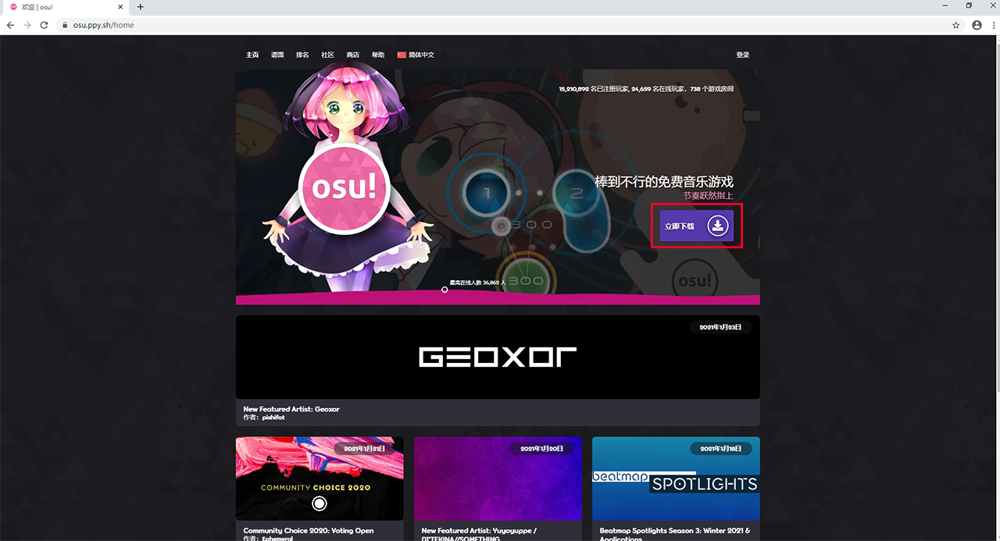
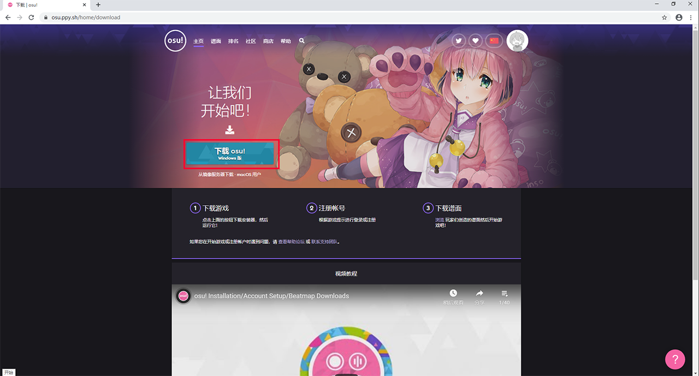
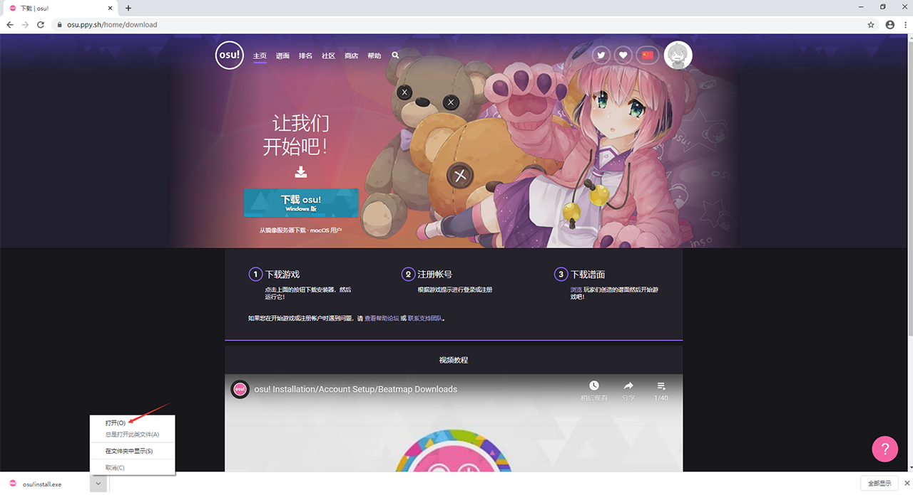
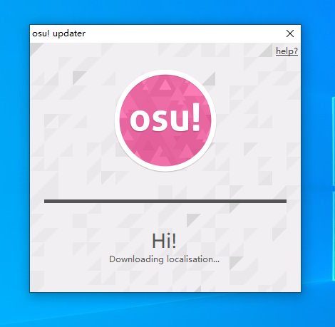
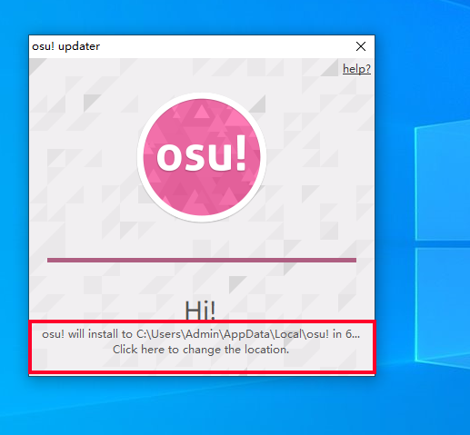
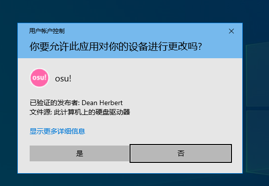

# Windows系统

_另见：_[_在 macOS 上安装_](an-zhuang/macos.md)

本页面会简单的告诉你如何让 osu! 在 Windows 上运行。

## 最低系统要求

* .NET framework 4+ （安装程序应该会提示你下载，如果没有，你可以在[这里](https://www.microsoft.com/zh-cn/download/details.aspx?id=48130)找到。）
* 一张不错的显卡（包括核显。）

## 安装 osu!

1. 首先打开 [osu! 官网](https://osu.ppy.sh/) 你应该会看见下图所示样子（如果与下图不同，可能官网已更新。）

2. 点击图片中红框位置的`立即下载`前往下载页。

3. 随后在下载页中，点击图片中的红框下载 Windows版 osu!

4. 等待下载完成后，打开 osu!install.exe 。

5. 打开 osu!install.exe 后，会显示下图界面。这时程序会自动联网下载 osu! （如果网速过慢或无法下载请到[贴吧](https://tieba.baidu.com/p/6051142501)。）

6. 安装程序在下载完本地化文件后会有10秒时间可以选择安装位置，点击红框位置以选择安装位置。如不选择则默认安装在` %userprofile%AppData\Local `下。

7. 安装完毕后会自动打开， osu! 将自动启动并使用 osu!direct 为你下载一些新手谱面。

*注意：部分系统会弹出UAC提示，请点击`是`允许 osu! 的运行*

8. 接下来，登录账号即可游玩。

*如果没有账号，请见[注册](registration.md)*

## 排除问题

如果你正在使用64位的 Windows 7，osu! 的安装可能会有点难。试下安装64位的 .NET Framework，如果安装程序无法提供，你可以[在这下载](https://download.microsoft.com/download/2/0/e/20e90413-712f-438c-988e-fdaa79a8ac3d/dotnetfx35.exe)。

---

**如果安装程序在尝试安装时出现错误，可以尝试如下操作：**

* 尝试重新安装最新版的 .NET Framework。[你可以在这里找到](https://dotnet.microsoft.com/download)。
* 清理你的系统 —— 用防病毒软件扫描和清理系统注册表。CCleaner 是一个不错的软件，它可以提供常规的清理操作。扫描系统的文件和注册表。如果识别到系统有以前安装但未被删除的 osu! 注册表时，安装程序便不能正常运行。

## 添加谱面

_另见：_[_谱面_]()

有两种添加谱面的方式，分别是在网站下载和 osu!direct （需要成为 [osu!supporter]() 。）

### 网站下载

1. 前往[谱面列表](https://osu.ppy.sh/beatmapsets)并且登录。
2. 找一个你想玩的乐曲。
3. 单击下载按钮保存谱面文件到电脑上。
4. 找到后缀名为 `.osz` 的谱面文件并打开。
   * 或者，你也可以把谱面文件放入 osu! 安装目录下的 `Songs` 文件夹。
5. osu! 会处理好余下的事情并加载谱面。
   * 如果你因为某些原因没看到它们，在[歌曲选择]()页面内按下 `F5` 来重新处理谱面文件。

### osu!direct

_注意：你需要拥有 osu!supporter 标签和互联网连接来使用 osu!direct。_

1. 打开 osu!，然后点击主页右侧的 `osu!direct` 按钮。
2. 找一个你想玩的乐曲。
3. 双击列表内的乐曲或点击右边的 `Download` 按钮来下载它。
   * 如果你不想下载随谱面文件一起的视频文件，点击 `DL NoVideo`。
4. osu! 完成下载后，将会自动加载谱面。
   * 如果你因为某些原因没看到它们，在[歌曲选择]()页面内按下 `F5` 来重新处理谱面文件。

## 添加皮肤

_另见：_[_皮肤_](pi-fu/skinning.md)

1. 前往[皮肤论坛](https://osu.ppy.sh/community/forums/15)找一个你喜欢的皮肤。
2. 找到了之后就下载。
3. 按照皮肤制作者的打包方式做不同的事情：
   * 如果皮肤是 `.osk`：
     1. 直接打开或者拖入 osu!。
     2. osu! 将会处理皮肤文件，并且帮你自动选择好。
   * 如果皮肤是压缩包（比如 `.7z`， `.rar`， `.zip`，等等）：
     1. 先解压。
     2. 把皮肤文件夹移动到 osu! 安装目录下的 `Skins` 文件夹。
     3. 如果 osu! 还开着，你可能需要按下 `Ctrl` + `Alt` + `Shift` + `S` 来让皮肤出现在列表。
     4. 在 osu! 里进入[选项（Options）]()搜索 `皮肤（Skin）`。
     5. 下滑到 `当前皮肤：` 选项，选择下载好的皮肤。

