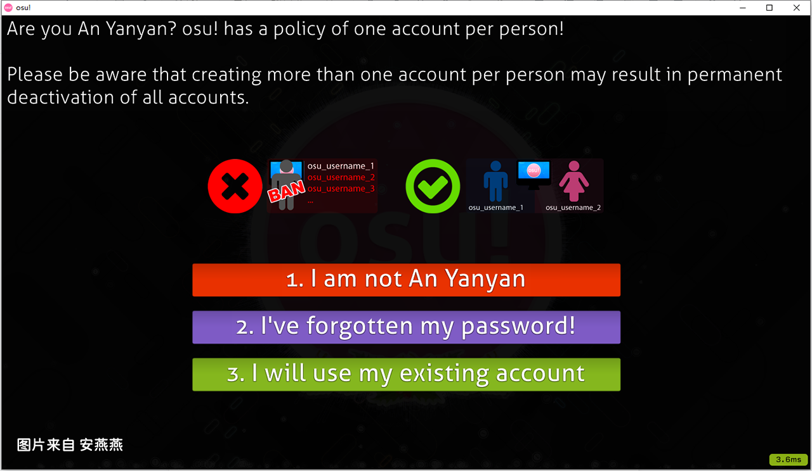

# 注册

_警告：在任何时候，拥有一个以上的 osu! 账户都违反 [规章制度](rules.md) !_

*另见：[安装 osu!](an-zhuang/windows.md) 。*

1. 打开你的 osu! 点击左上角进入登录页面。

2. 点击`Creste an account` （如果是中文则是`注册账号`。）

3. 随后输入个人信息，如下：

| 英文 | 中文 | 解释 |
| --- | --- | --- |
| Username | 用户名 | 用户名最多只能有15个字符，用户名只能由字母 \(`a-z`, `A-Z`, `0-9`\)，下划线 \(`_`\)，方括号\(`[` 和 `]`\)，破折号\(`-`\)，和空格\( ``\)组成。成为[osu!supporter]()可以免费修改一次用户名，此后的修改则需要向服务器捐赠一定数量的费用，请谨慎取名！ |
|Email Address|邮箱地址|请使用你自己的常用邮箱。在你异地登录或重置密码时，你可能需要打开邮箱以接收验证码，所以千万不要丢失你的邮箱。|
|Password|用户密码|请使用不少于8个字符的密码。|

4. 输入完毕后，点击`Create my account!`。这时，如果没有问题，osu! 会自动登录。

*注意：有时候会遇到图片中所示界面，这是 osu! 检测到你的电脑上有其他账号存在。基于 [规章制度](rules.md)，你不能拥有一个以上账号。如果你确定你的确没有账号，请点击第一个按钮确认注册。*

## 接下来做什么？

请不要忘记认真阅读[规章制度](rules.md)!

一旦完成注册，你就可以开始节奏之旅了。你可以[添加谱面](an-zhuang/windows.md#tian-jia-pu-mian)进行游玩，[制作皮肤](pi-fu/skinning.md)或者[制作谱面]()。你也可以在论坛中的版块[介绍（Introductions）](https://osu.ppy.sh/community/forums/8)来介绍自己。

如果你需要进一步的游戏内帮助，你可以在游戏中通过聊天控制台\(在游戏中按 `F8` 或者 `F9` \) 然后输入`/join help`,在`#help`[IRC]() \(互联网中继聊天\)中寻求帮助。你也可以将你的问题发布在论坛版块[帮助（Help）](https://osu.ppy.sh/community/forums/5)。

